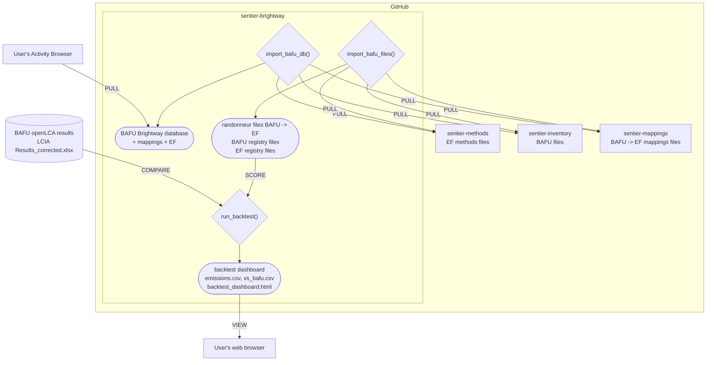

# sentier-brightway

BAFU-2026 v1 life cycle inventory, the EF 3.1 biosphere and the 25 EF 3.1 impact methods,
linked through the Sentier flow mappings, ready for Brightway and Activity Browser. Data is
pulled from the public Sentier repositories on first use; nothing ships in the package.

## Install

    pip install git+https://github.com/sentier-dev/sentier-brightway

Install it in the Python environment where Brightway or Activity Browser lives.

## Tooling

| Command | What it does |
|---|---|
| `sentier-brightway db --project NAME` | Installs the databases and methods into a Brightway project. |
| `sentier-brightway files --out DIR` | Writes the same build as plain files (parquet + bw_processing datapackages). No bw2data needed. |
| `sentier-brightway coverage` | Prints how many BAFU flows link to EF 3.1, without touching Brightway. |
| `sentier-brightway backtest --out DIR` | Scores every process and compares with BAFU's own openLCA results, with a dashboard. |

The same from Python: `import_bafu_db(project)`, `import_bafu_files(out_dir)` and
`backtest.run_backtest(...)` in `sentier_brightway`.

## Brightway project

    sentier-brightway db --project my-project

After a few minutes the project holds:

| Object | Content |
|---|---|
| database `bafu-2026` | 11,947 BAFU-2026 v1 processes |
| database `ef-3.1-biosphere` | EF 3.1 elementary flows, with BAFU emissions relinked onto them |
| database `bafu-2026-residual` | the few BAFU flows with no EF 3.1 counterpart (kept, no factor) |
| methods `("sentier", "EF v3.1", <category>)` | 25 EF 3.1 impact categories |

Link your own activities to `bafu-2026` processes and `ef-3.1-biosphere` flows, then score
with stock bw2calc. In Activity Browser, restart or reload the project after the install;
the methods appear under `sentier` > `EF v3.1`.

## Plain files

    sentier-brightway files --out ./bafu-2026-ef31

    registry/       processes, biosphere, exchanges, methods, characterization factors (parquet)
    mappings/       the BAFU -> EF 3.1 mapping files, verbatim
    bw_package/     bw_processing datapackages: the inventory and one per method
    manifest.json   data pins, citation, coverage, row counts

Every table shares an integer `bw_id` that is also the matrix index of the datapackages, so
`registry/processes.parquet` is the lookup from a process to a demand vector. Stock bw2calc
reads the datapackages directly:

    import bw2calc as bc, bw_processing as bwp, pandas as pd
    from pathlib import Path

    out = Path("./bafu-2026-ef31")
    procs = pd.read_parquet(out / "registry/processes.parquet")
    bw_id = int(procs.loc[procs.name.str.startswith("Electricity, low voltage, production CH"), "bw_id"].iloc[0])
    fs = bwp.generic_directory_filesystem
    lca = bc.LCA({bw_id: 1.0}, data_objs=[
        bwp.load_datapackage(fs(dirpath=out / "bw_package/bafu-2026")),
        bwp.load_datapackage(fs(dirpath=out / "bw_package/methods/ef-3.1__climate-change")),
    ])
    lca.lci(); lca.lcia(); lca.score   # 0.0320835 kg CO2 eq per kWh

`sentier_brightway.datapackage.score(out, code, "ef-3.1:climate-change")` is the one-line
shortcut for the same thing.

## Backtest dashboard

    pip install "sentier-brightway[fast]"          # optional: pypardiso solver
    sentier-brightway backtest --out dashboard
    python -m http.server 8000 --directory dashboard   # open backtest_dashboard.html

Scores all 11,947 processes for the 25 categories in a few seconds and compares each score
with BAFU's published openLCA table (`--xlsx` points at the results xlsx or zip). The
dashboard shows percent differences and absolute scores per category; `emissions.csv` and
`vs_bafu.csv` hold the same numbers. On the current data every process matches a table row
and the categories agree with BAFU within a fraction of a percent at the median, except human
toxicity cancer, where BAFU and EF count chromium differently.

## Options

| Flag | Commands | Effect |
|---|---|---|
| `--overwrite` | db, files | Replace a previous install or export. |
| `--data-root DIR` | all | Read the Sentier data repos from local clones under `DIR` instead of downloading (`$SENTIER_DATA_ROOT` works too). |
| `--skip-nomenclature` | all | Leave BAFU flows whose EF counterpart carries no factor in the residual database. |
| `--no-datapackages` | files | Skip `bw_package/`. |
| `--files DIR` | backtest | Reuse an existing files export instead of writing one. |

## Coverage

Current data links 2,580 of 2,679 BAFU flows (96.3 %) and 97.6 % of biosphere exchanges to
EF 3.1. The 99 unlinked flows stay in `bafu-2026-residual` with their exchanges intact.
`sentier-brightway coverage` prints the full report for the pinned data.

## Limitations (v0.1)

- Global EF factors only; regionalized factors (for example country water-use) are not installed.
- Only BAFU-2026 v1 and EF 3.1.
- The datapackages carry static values; no uncertainty distributions yet.
- The backtest dashboard has no flow drill-down.

## Licence and citation

Code: MIT. Data comes from the Sentier repositories under their own licences. BAFU data:
*Source: Life Cycle Inventory database of the Swiss Federal Administration, BAFU:2026.*
Keep this citation in any work derived from the installed data.

## Development

    uv run --extra testing pytest
    uv run --extra dev pre-commit run --all-files
    uv run python scripts/pin_sources.py   # re-pin after the data repos change
