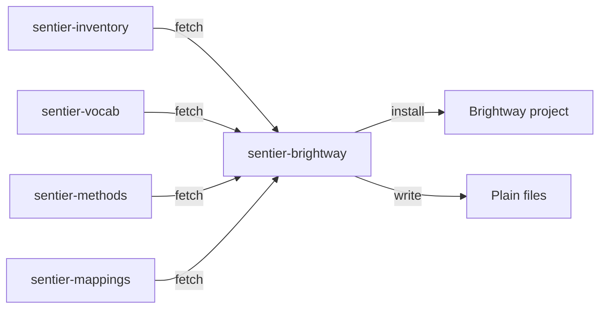

# sentier-brightway



## What it is

BAFU-2026 v1 life cycle inventory, the EF 3.1 biosphere and the 25 EF 3.1 impact methods, linked through the Sentier flow mappings. Ready for Brightway and Activity Browser.
Data is fetched from pinned commits of the four Sentier data repos on first use. Nothing ships in the package. Install it in the Python environment where Brightway or Activity Browser lives.


## Install

```
uv pip install git+https://github.com/sentier-dev/sentier-brightway
```

## Use

| Command | What it does |
|---|---|
| `uv run sentier-brightway db --project NAME` | Installs the databases and methods into a Brightway project. |
| `uv run sentier-brightway files --out DIR` | Writes the same build as plain files (parquet + bw_processing datapackages). No bw2data needed. |
| `uv run sentier-brightway coverage` | Prints how many BAFU flows link to EF 3.1, without touching Brightway. |
| `uv run sentier-brightway backtest --out DIR` | Scores every process, compares with BAFU's own openLCA results, writes a dashboard. |
| Python API | `import_bafu_db(project)`, `import_bafu_files(out_dir)` and `backtest.run_backtest(files_dir, xlsx, out_dir)` in `sentier_brightway`. |

### Brightway project

| Object | Content |
|---|---|
| database `bafu-2026` | 11,947 BAFU-2026 v1 processes |
| database `ef-3.1-biosphere` | EF 3.1 elementary flows, with BAFU emissions relinked onto them |
| database `bafu-2026-residual` | BAFU flows with no EF 3.1 counterpart (kept, no factor) |
| methods `("sentier", "EF v3.1", <category>)` | 25 EF 3.1 impact categories |

Link your own activities to `bafu-2026` processes and `ef-3.1-biosphere` flows, then score with stock bw2calc. In Activity Browser, reload the project after the install; the methods sit under `sentier` > `EF v3.1`.

### Plain files

| Path | Content |
|---|---|
| `registry/` | processes, biosphere, exchanges, methods, characterization factors (parquet) |
| `mappings/` | the BAFU -> EF 3.1 mapping files, verbatim |
| `bw_package/` | bw_processing datapackages: the inventory and one per method |
| `manifest.json` | data pins, citation, coverage, row counts |

Every table shares an integer `bw_id`, which is also the matrix index of the datapackages. Stock bw2calc reads them: `bw_processing.load_datapackage` on `bw_package/bafu-2026` plus one `bw_package/methods/<slug>` feeds `bw2calc.LCA({bw_id: 1.0}, data_objs=[...])`.
`sentier_brightway.datapackage.score(out, code, "ef-3.1:climate-change")` does the same in one call (CH low-voltage electricity: 0.0320835 kg CO2 eq per kWh).

### Backtest dashboard

```
uv run sentier-brightway backtest --out dashboard
```

Then serve the folder (for example `uv run python -m http.server 8000 --directory dashboard`) and open `backtest_dashboard.html`. `--xlsx` points at BAFU's results xlsx or zip; the `fast` extra adds the pypardiso solver.
`emissions.csv` and `vs_bafu.csv` hold the numbers. Categories agree with BAFU within a fraction of a percent at the median, except human toxicity cancer, where BAFU and EF count chromium differently.

### Options

| Flag | Commands | Effect |
|---|---|---|
| `--overwrite` | db, files | Replace a previous install or export. |
| `--data-root DIR` | all | Read the Sentier data repos from local clones under `DIR` instead of downloading (`$SENTIER_DATA_ROOT` works too). |
| `--skip-nomenclature` | all | Leave BAFU flows whose EF counterpart carries no factor in the residual database. |
| `--no-datapackages` | files | Skip `bw_package/`. |
| `--files DIR` | backtest | Reuse an existing files export instead of writing one. |

## Data

Pinned data links 2,566 of 2,679 BAFU flows (95.8 %) and 96.8 % of biosphere exchanges to EF 3.1. The 113 unlinked flows stay in `bafu-2026-residual` with their exchanges intact. Pins live in `src/sentier_brightway/sources.toml`; `uv run sentier-brightway coverage` prints the full report.

Limitations (v0.1): global EF factors only, no regionalized factors such as country water use; only BAFU-2026 v1 and EF 3.1; static values, no uncertainty distributions; no flow drill-down in the backtest dashboard.

## Contributing

- `uv run --extra testing pytest` runs the tests.
- `uv run --extra dev pre-commit run --all-files` runs the formatter and lint hooks.
- `uv run python scripts/pin_sources.py` re-pins `sources.toml` after the data repos change.

## Licence and citation

Code: MIT. Data comes from the Sentier repositories under their own licences. BAFU data:
*Source: Life Cycle Inventory database of the Swiss Federal Administration, BAFU:2026.*
Keep this citation in any work derived from the installed data.
